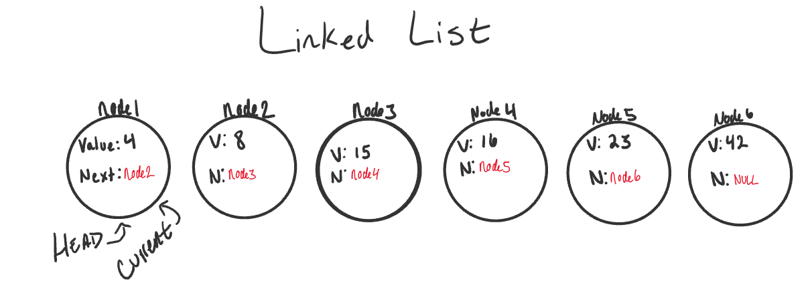
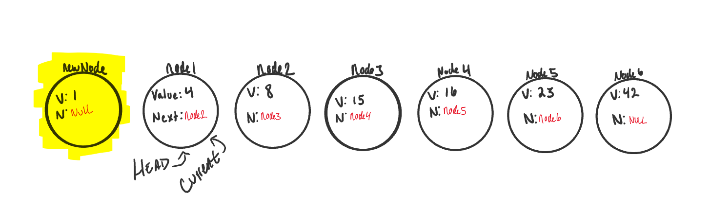
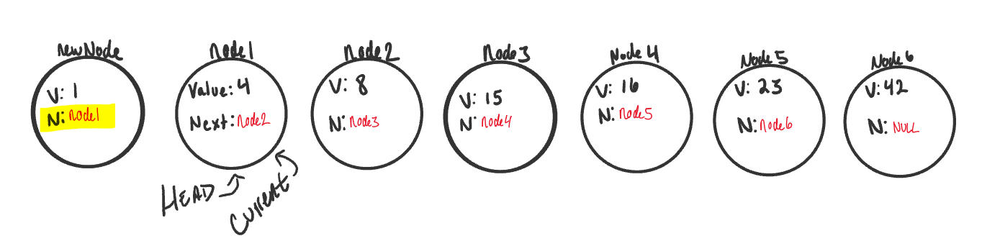
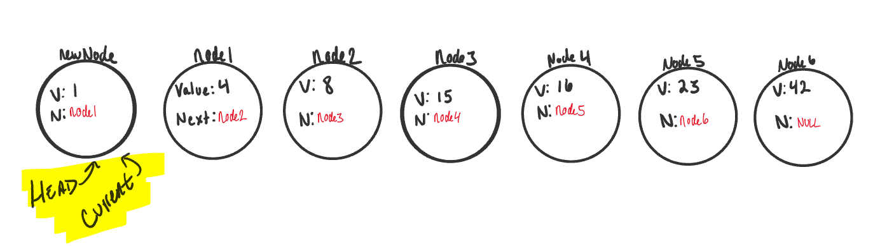
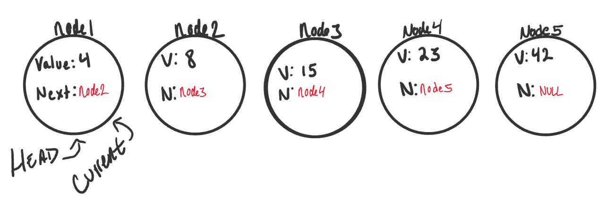
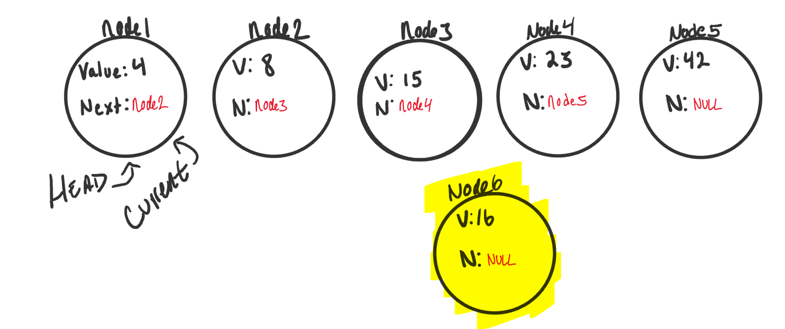
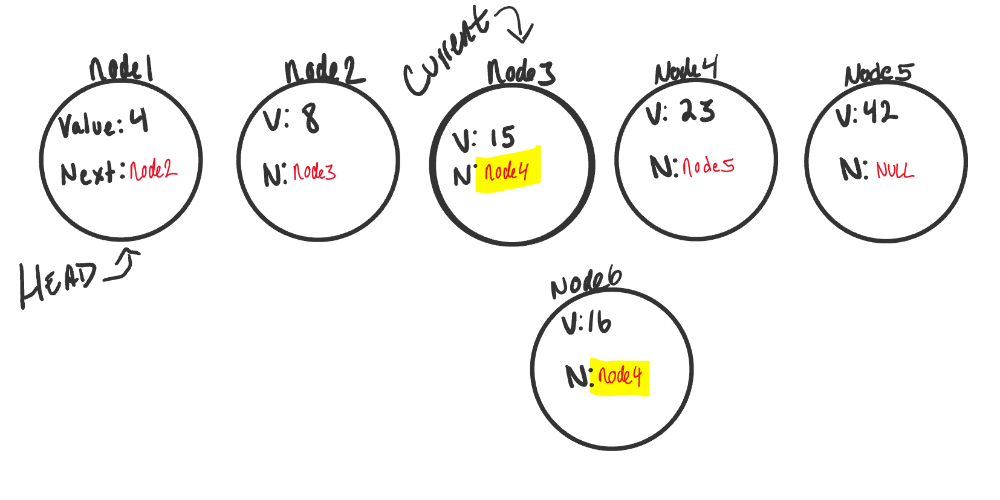
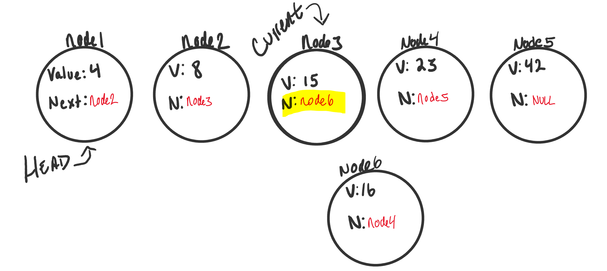
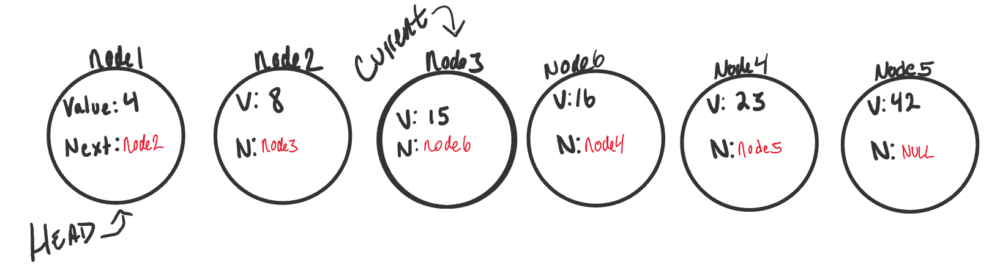

# Linked Lists

## What is a Linked List
A Linked List is a sequence of `Nodes` that are connected/linked to each other. The most defining feature
of a Linked List is that each `Node` references the next `Node` in the link.

There are two types of Linked List - Singly and Doubly. We will be implementing a Singly Linked List in this implementation.

## Terminology:
1. *Linked List* - A data structure that contains nodes that links/points to the next node in the list.
1. *Singly* - Singly refers to the number of references the node has. A `Singly` linked list means that there is only one reference,
and the reference points to the `Next` node in a linked list.
1. *Doubly* - Doubly refers to there being two (double) references within the node. A `Doubly` linked list means that there
is a reference to both the `Next` and `Previous` node.
2. *Node* - Nodes are the individual items/links that live in a linked list. Each node contains the data for each link.
3. *Next* - Each node contains a property called `Next`. This property contains the reference to the next node.
4. *Head* - The Head is a reference type of type `Node` to the first node in a linked list.
5. *Current* - The `Current` reference is a reference type of type `Node` that is currently being looked at. This node is traditionally used when
traversing through a full linked list. When traversing, you typically reset the current to the head to guarantee you are starting
from the beginning of the linked list.

## What does it look like

This is what a Singly Linked List looks like

{:target="_blank"}


### Traversal

When traversing a linked list, you are not able to use a `foreach` or `for` loop. We depend on the `Next` value
in each node to guide us where the next reference is pointing. The `Next` property is exceptionally important because
it will lead us where the next node is and allow us to extract the data appropriately.

The best way to approach a traversal is through the use of a `while()` loop. This allows us to continually check
that the `Next` node in the list is not null. If we accidentally end up trying to traverse on a node that is `null`,
a `NullReferenceException` gets thrown and our program will crash/end.

When traversing through a linked list, the `Current` node is the most helpful. The `Current` will tell us
where exactly in the linked list we are and will allow us to move/traverse forward until we hit the end.

#### Example
Let's put a use case on our traversal. We want to check whether or not our LinkedList `Includes` a specific value.

The pseudo-code for an `Includes` is as so:

```javascript
		ALGORTIHM Includes (value)
		// INPUT <-- integer value
		// OUTPUT <-- boolean
			
			Current <-- Head

			WHILE Current is not NULL
				IF Current.Value is equal to value
					return TRUE

				Current <-- Current.Next

			return FALSE
```

Let's talk out what exactly is happening:
1. We are first setting `Current` to the `Head` to guarantee we are starting from the beginning. (Remember that `Head` is always the first node in a Linked List)

2. We create a `while` loop. This loop will only run if the node that `Current` is pointing to
is not null. This also means we can guarantee that we are still looking at a Node while the loop is running.

3. Once we are in the while loop, we are checking if the value of the current node is equal to the value we are looking for. 
Given the logic, if that condition is true, then we have found the value we were looking for, so we return true.

4. If the `Current` node does not contain the value we are looking for, we then must move Current to the next node that is 
being referenced. Again, because the condition of this while loop is to only run if we are still at a node, we can safely 
traverse to the next node without fear of getting a `NullReferenceException`. 

5. At this point, the while loop is re-evaluated. Step 3 & 4 will continue until `Current` reaches the end of the LinkedList. We will know we are at the last node in
the linked list because the current node will be null. Once this condition becomes true, the while loop breaks, and we now know that we are at the end. 

6. Once we hit the end, we know that we did not find the value and return true at any point, so the value is not in the LinkedList. We return false.

#### Big O
The Big O of time for `Includes` would be O(n). This is because, at its worse case, the node we are looking for will be
the very last node in the linked list. n represents the number of nodes in the linked list.

The Big O of space for `Includes` would be O(1). This is because there is no additional space being used than what is already given to us with the linked list input. 

### Adding a Node

#### Adding O(1)

Order of operations is extremely important when it comes to working with a Linked List.
What I mean by this is you must be careful that all references to each link/node is properly assigned. 

An example can be with adding a node to a linked list.
If we want to add a node with an `O(1)` efficiency, we have to replace the current `Head` of the linked list with the
new node, without losing the reference to the next node in the list. 

Here are the required steps to add a new node with an O(1) efficiency.

1. Set `Current` equal to `Head`. This will guarantee us that we are starting from the very beginning. 
2. We can then instantiate the new node that we are adding. The values passed in as arguments into the `Add()` method
will define what the value of the Node will be. 

{:target="_blank"} 

3. `newNode.Next` by default is set to `null`. We want to set `newNode.Next` property to the same location that the `Head` node is pointing towards.
Because `Head` is just a reference type, we will be assigning it to the same allocation in memory as the node it is pointing too. In this
case, it's `Node1`. 

{:target="_blank"} 


4. At this point in the program we now "technically" have `newNode` at the beginning of the linked list, but we are not done yet. 
We now have to re-assign where `Head` is pointing too. Since `Node1` is no longer the first node in the list, we want to re-assign `Head` to
point at `newNode`. 

5. While we are at it, let's just re-assign current as well to make sure should any further operation start at the new true start of the
linked list. 

{:target="_blank"} 


#### Code

Here is the Pseudo code for an `Add` method on a Linked list

```javascript
		ALGORITHM Add(newNode)
		// INPUT <-- Node to add 
		// OUTPUT<-- No output

			Current <-- Head
			newNode.Next <-- Head
			Head <-- newNode
			Current <-- Head
```
##### Big O
Regardless of the number of Nodes that this linked list has, it will always be a O(1) time and space because it takes the same
amount of time to add a new node to the beginning of the list, and no additional resources are being used 


#### Adding a Node O(n)
Adding a node to the middle of a linked list is a bit different than adding to the beginning. This is because we are working with
more nodes and must re-allocate to make room for the new node.

1. Let's start out with a basic Singly Linked List:

{:target="_blank"}

2. Now let's create a new node (node6). We will set the value of `node6` to be 16. The `Next` will be null
because we haven't yet attached it into the linked list.

{:target="_blank"}


3. Now let's start the adding. We can do an `AddBefore` method or an `AddAfter`. For this documentation, we will do
an `AddBefore`. The `AddAfter` is extremely similar...see if you can figure it out on your own!

Our AddBefore method that we will demonstrate will insert `node6` before `node4`. 

We already learned how to traverse earlier, and that is exactly what we want to do now. We will traverse while 
the next node is not null. Before moving `Current` to the next node, we want check if the value of the next node
is equal to the value we are supposed to be watching for (the value of the existing node we are inserting before).
If it is, we want to set the new node (`node6`)'s .Next equal to the existing node.  

{:target="_blank"}

The Linked List image above is in the following state:
1. Current is pointing to `node3`.
2. `node3.Next` property is equal to `node4`.
3. Since this is the node we want to insert before, we can now set our `node6.Next` property also to `node4`. We do this at the time
the node is found to prevent setting `node6.Next` to a node that may not exist. 
4. *Uh-Oh*, now both `node3` and `node6` are pointing to the same next node. `node6` is not quite fully apart of the linked list. 
5. Next, we have to adjust `node3.Next` to point to the newly created node, `node6`. Since we still have `Current` pointing to `node3` this will 
be a straightforward transaction. We just simply tell `Current` (because it is pointing to the same 
memory location as `node3`) to change it's `Next` to point to the new node (`node6`).

{:target="_blank"}

And now we have a complete link list with the newly added node exactly where we wanted it.

{:target="_blank"}


##### Code


Here is the Pseudo code for an `AddBefore` method in a linked list

```javascript
		ALGORITHM AddBefore(newNode, existingNode)
		// INPUT <-- New Node, Existing Node
		// OUTPUT <-- No Output

			Current <-- Head

			while Current.Next is not equal to NULL
				if Current.Next.Value is equal to existingNode.Value
					newNode.Next <-- existingNode
					Current.Next <-- newNode

				Current <-- Current.Next;		
```


##### Big O
The time efficiency of this transaction would be O(n) because we could be inserting the new node, worst case scenario, at the end. 
With n being the number of nodes possible, we would therefore have O(n) time efficiency.

Space efficiency would stay at an O(1) because, like before, no additional space is being used allocated outside of what is given to us on the input


### Print Out Nodes

Printing out all of the nodes in a Linked List is very similar to what we did in the `Find()` method. This is because
we are leveraging our `Current` node and a `while` loop to traverse through the existing linked list. 

Here is the pseudo code for a method to print out all the nodes in a linked list:

```javascript
		ALGORITHM Print()
		// INPUT <-- None
		// OUTPUT <-- string to console

			Current <-- Head

			while Current.Next is not equal to NULL
				OUTPUT <-- "Current.Value --> "
				Current <-- Current.Next

			OUTPUT <-- "Current.Value --> NULL"
```

Much like in the `Find`, we are creating a while loop to check and make sure we are not at the end of a linked list. Right
before the while loop restarts, we move `Current` to equal the next node in the list. 

Once we hit the end, we write out the last node, and then show that it is pointing to null. 

## Prerequisites

When constructing your code, a few things to keep in mind. 
1. When making your `Node` class, consider requiring a value to be passed in to require that each node has a value.

2. When making a Linked List, you may want to require that at least one node gets passed in upon instantiation. 
This first node is what your `Head` and `Current` will point too.

